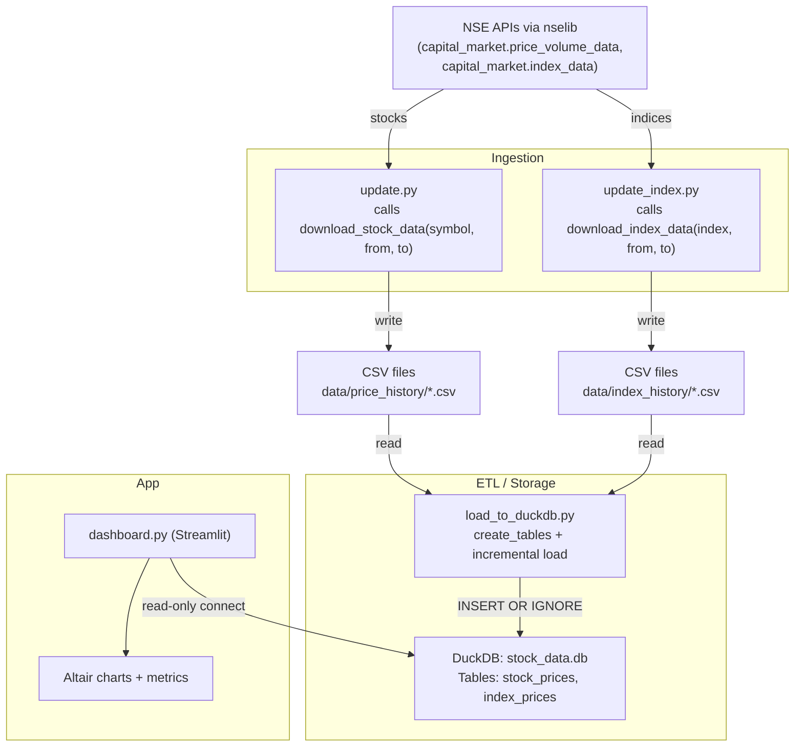

## Architecture

### Overview
This document describes the end-to-end data flow and components of the Stock Dash application. The system ingests market data from NSE via `nselib`, stages it into CSV files, incrementally loads it into a DuckDB database, and visualizes it in a Streamlit dashboard.

### Data Flow Diagram


### Components
- **Data sources**: NSE endpoints accessed through `nselib.capital_market`.
- **Ingestion scripts**:
  - `update.py`: Reads stock symbols from `data/ind_nifty500list.csv`, downloads per-symbol history to `data/price_history/<SYMBOL>.csv` via `download_stock_data`.
  - `update_index.py`: Iterates a fixed set of indices and downloads history to `data/index_history/<INDEX>.csv` via `download_index_data`.
- **ETL / Storage**:
  - `load_to_duckdb.py`: Creates DuckDB tables if missing and incrementally loads new rows from CSV into `stock_data.db`.
- **Application**:
  - `dashboard.py`: Streamlit UI; queries DuckDB read-only, computes rolling metrics, and renders OHLC + volume charts with Altair.

### Ingestion details
- **Stocks (`download_stock_data`)**
  - If a CSV exists, determines existing min/max `DATE` and fetches only missing ranges.
  - Fetches in safe 60-day chunks via `_fetch_equity_history_nselib(symbol, from, to)`.
  - Normalizes columns to: `DATE, OPEN, HIGH, LOW, CLOSE, VOLUME, SYMBOL, SERIES`.
  - De-duplicates by `DATE` and sorts before writing.
- **Indices (`download_index_data`)**
  - Calls `capital_market.index_data` for `[from_date, to_date]` and writes CSV after renaming `TIMESTAMP→Date`, `CLOSE_INDEX_VAL→Close`.

### ETL details (`load_to_duckdb.py`)
- Creates tables if not present:
```sql
CREATE TABLE IF NOT EXISTS index_prices (
  date DATE,
  symbol VARCHAR,
  open DOUBLE,
  high DOUBLE,
  low DOUBLE,
  close DOUBLE,
  volume BIGINT,
  turnover DOUBLE,
  PRIMARY KEY (date, symbol)
);

CREATE TABLE IF NOT EXISTS stock_prices (
  date DATE,
  symbol VARCHAR,
  series VARCHAR,
  open DOUBLE,
  high DOUBLE,
  low DOUBLE,
  prev_close DOUBLE,
  ltp DOUBLE,
  close DOUBLE,
  vwap DOUBLE,
  volume BIGINT,
  value DOUBLE,
  trades BIGINT,
  PRIMARY KEY (date, symbol, series)
);
```
- Incremental load strategy:
  - For each file, query `MAX(date)` per `symbol` from the target table.
  - Read CSV, drop duplicates, parse dates (`%Y-%m-%d` for stocks as `DATE`; `%d-%m-%Y` for indices as `Date`).
  - Keep only rows where CSV date is strictly newer than the latest stored date.
  - Clean column names to alphanumerics/underscore (`clean_col_names`).
  - Use a registered temp view and `INSERT OR IGNORE` to load the expected columns.

### Dashboard and analytics (`dashboard.py`)
- Maintains a cached read-only DuckDB connection (`st.cache_resource`).
- Builds a unified symbol list from `stock_prices` and `index_prices`.
- On selection, loads `WHERE symbol = ? ORDER BY date ASC` from the appropriate table.
- Computes rolling mean/std and ±1/2/3 sigma bands on `close` (or `vwap` when toggled for stocks) and renders:
  - OHLC with colored bars and wicks.
  - Volume sub-chart.
  - KPI metrics for current Price, Last Updated, and sigma bounds (with deltas when possible).

### Data formats
- **Stock CSV** (per symbol): `DATE, OPEN, HIGH, LOW, CLOSE, VOLUME, SYMBOL, SERIES`.
- **Index CSV** (per index): includes `Date`, `Close`, and other NSE-provided columns; file name uses underscores for spaces.
- **Database tables**: `stock_prices` and `index_prices` as defined above.

### Incrementality and idempotency
- Ingestion fetches only missing date ranges relative to existing CSVs.
- ETL inserts only rows with `date > MAX(date)` per `symbol` and relies on primary keys plus `INSERT OR IGNORE` for safety.

### Operations
- **Update stocks**: `python update.py`
- **Update indices**: `python update_index.py`
- **Load/refresh DB**: `python load_to_duckdb.py`
- **Run dashboard**: `streamlit run dashboard.py`

### Caching and performance
- Streamlit uses `@st.cache_resource` for the DuckDB connection and `@st.cache_data` for symbol lists/data loading, reducing repeated I/O.

### Repository layout
- `download.py`: API integration and CSV writing for stocks/indices.
- `update.py`: Batch stock downloader (respects delay between requests).
- `update_index.py`: Batch index downloader (respects delay).
- `load_to_duckdb.py`: Table creation and incremental loads from CSV to DuckDB.
- `dashboard.py`: Streamlit application (query, compute, visualize).
- `data/price_history/`: Per-stock CSVs.
- `data/index_history/`: Per-index CSVs.
- `stock_data.db`: DuckDB database (generated). 