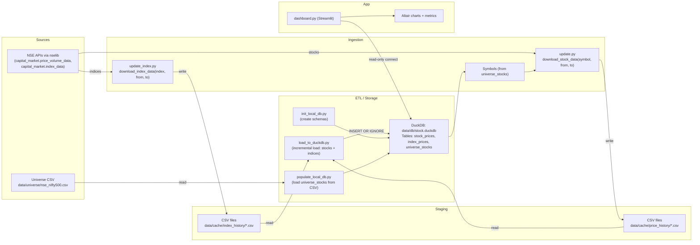

## Architecture

### Overview
This document describes the end-to-end data flow and components of the Stock Dash application. The system ingests market data from NSE via `nselib`, stages it into CSV files, incrementally loads it into a DuckDB database, and visualizes it in a Streamlit dashboard.

### Data Flow Diagram


### Components
- **Data sources**: NSE endpoints accessed through `nselib.capital_market`.
- **Ingestion scripts**:
  - `update.py`: Reads stock symbols from DuckDB `universe_stocks` (once populated), downloads per-symbol history to `data/cache/price_history/<SYMBOL>.csv`. CLI: `--db-file`, `--exchange`, `--delay`.
  - `update_index.py`: Iterates a fixed set of indices and downloads history to `data/cache/index_history/<INDEX>.csv`.
- **ETL / Storage**:
  - `init_local_db.py`: Creates DuckDB schemas for `universe_stocks`, `index_prices`, and `stock_prices`. CLI: `--db-file`.
  - `populate_local_db.py`: Populates `universe_stocks` from `data/universe/nse_nifty500.csv`. CLI: `--db-file`, `--csv-file`.
  - `load_to_duckdb.py`: Incrementally loads new rows from price/index CSVs into DuckDB. CLI: `--db-file`.
- **Application**:
  - `dashboard.py`: Streamlit UI; queries DuckDB read-only, computes rolling metrics, and renders OHLC + volume charts with Altair.

### Ingestion details
- **Stocks (`download_stock_data`)**
  - If a CSV exists, determines existing min/max `DATE` and fetches only missing ranges.
  - Fetches in safe 60-day chunks via `_fetch_equity_history_nselib(symbol, from, to)`.
  - Normalizes columns to: `DATE, OPEN, HIGH, LOW, CLOSE, VOLUME, SYMBOL, SERIES` (CSV).
  - De-duplicates by `DATE` and sorts before writing.
- **Indices (`download_index_data`)**
  - Calls `capital_market.index_data` for `[from_date, to_date]` and writes CSV after renaming `TIMESTAMP→Date`, `CLOSE_INDEX_VAL→Close`.

### Database schemas (`init_local_db.py`)
- Creates the following tables if not present:
```sql
CREATE TABLE IF NOT EXISTS universe_stocks (
  "Company Name" VARCHAR NOT NULL,
  "Industry"     VARCHAR,
  "Symbol"       VARCHAR NOT NULL,
  "Exchange"     VARCHAR DEFAULT 'NSE',
  "code"         VARCHAR,
  PRIMARY KEY ("Symbol", "Exchange")
);

CREATE TABLE IF NOT EXISTS index_prices (
  date DATE,
  symbol VARCHAR,
  open DOUBLE,
  high DOUBLE,
  low DOUBLE,
  close DOUBLE,
  volume BIGINT,
  turnover DOUBLE,
  PRIMARY KEY (date, symbol)
);

CREATE TABLE IF NOT EXISTS stock_prices (
  date DATE,
  symbol VARCHAR,
  exchange VARCHAR,
  open DOUBLE,
  high DOUBLE,
  low DOUBLE,
  prev_close DOUBLE,
  ltp DOUBLE,
  close DOUBLE,
  vwap DOUBLE,
  volume BIGINT,
  value DOUBLE,
  trades BIGINT,
  PRIMARY KEY (date, symbol, exchange)
);
```

### ETL details
- **Populate universe (`populate_local_db.py`)**
  - Loads from `data/universe/nse_nifty500.csv` with mapping: `Series`→`Exchange='NSE'`, `ISIN Code`→`code`.
- **Load histories (`load_to_duckdb.py`)**
  - Index data: inserts into `index_prices` selecting expected fields.
  - Stock data: inserts into `stock_prices` with `exchange` set to `'NSE'`:
```sql
INSERT OR IGNORE INTO stock_prices
SELECT
  DATE,
  SYMBOL,
  'NSE' AS exchange,
  OPEN,
  HIGH,
  LOW,
  PREVCLOSE,
  LTP,
  CLOSE,
  VWAP,
  VOLUME,
  VALUE,
  NOOFTRADES
FROM temp_stock_df;
```

### Dashboard and analytics (`dashboard.py`)
- Maintains a cached read-only DuckDB connection (`st.cache_resource`).
- Builds a unified symbol list from `stock_prices` and `index_prices`.
- On selection, loads `WHERE symbol = ? ORDER BY date ASC` from the appropriate table.
- Computes rolling mean/std and ±1/2/3 sigma bands on `close` (or `vwap` when toggled for stocks) and renders:
  - OHLC with colored bars and wicks.
  - Volume sub-chart.
  - KPI metrics for current Price, Last Updated, and sigma bounds (with deltas when possible).

### Data formats
- **Stock CSV** (per symbol): `DATE, OPEN, HIGH, LOW, CLOSE, VOLUME, SYMBOL, SERIES`.
- **Index CSV** (per index): includes `Date`, `Close`, and other NSE-provided columns; file name uses underscores for spaces.
- **Database tables**:
  - `universe_stocks`: company metadata and exchange/code mapping.
  - `stock_prices`: OHLCV and related fields with `exchange` key.
  - `index_prices`: OHLCV and turnover for indices.

### Incrementality and idempotency
- Ingestion fetches only missing date ranges relative to existing CSVs.
- ETL inserts only rows with `date > MAX(date)` per symbol; `INSERT OR IGNORE` guards PK collisions.

### Operations
- **Initialize schemas**: `python init_local_db.py --db-file data/db/stock.duckdb`
- **Populate universe**: `python populate_local_db.py --db-file data/db/stock.duckdb --csv-file data/universe/nse_nifty500.csv`
- **Update stocks CSVs**: `python update.py --db-file data/db/stock.duckdb --exchange NSE --delay 2`
- **Update indices CSVs**: `python update_index.py`
- **Load/refresh DB**: `python load_to_duckdb.py --db-file data/db/stock.duckdb`
- **Run dashboard**: `streamlit run dashboard.py`

### Caching and performance
- Streamlit uses `@st.cache_resource` for the DuckDB connection and `@st.cache_data` for symbol lists/data loading, reducing repeated I/O.

### Repository layout
- `download.py`: API integration and CSV writing for stocks/indices.
- `update.py`: Batch stock downloader (respects delay between requests).
- `update_index.py`: Batch index downloader (respects delay).
- `init_local_db.py`: Creates DuckDB schemas.
- `populate_local_db.py`: Populates `universe_stocks` from CSV.
- `load_to_duckdb.py`: Incremental loads from CSV to DuckDB.
- `dashboard.py`: Streamlit application (query, compute, visualize).
- `data/cache/price_history/`: Per-stock CSVs.
- `data/cache/index_history/`: Per-index CSVs.
- `data/universe/nse_nifty500.csv`: Universe CSV.
- `data/db/stock.duckdb`: DuckDB database (generated). 